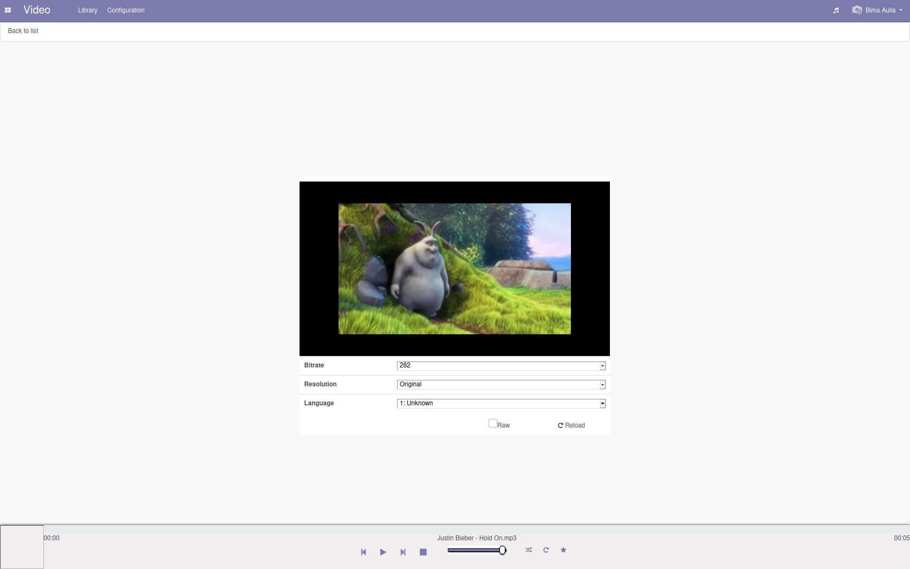
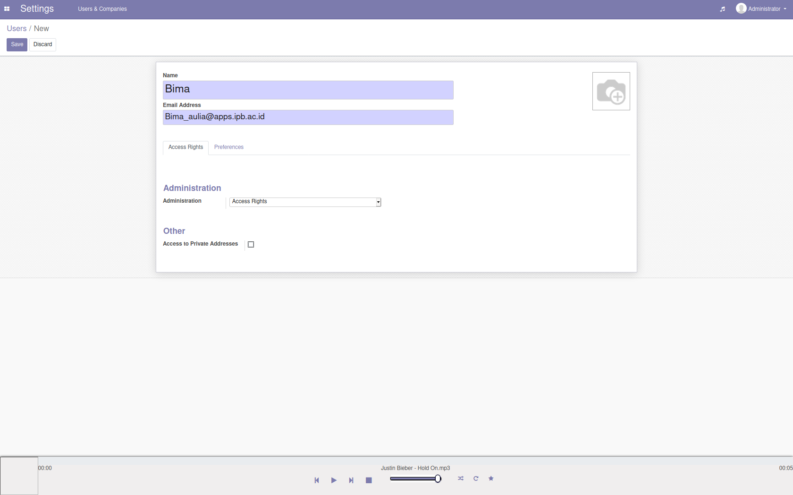

<h1 align="center"></h1>


[Instalasi](#instalasi) | [Otomatisasi](#otomatisasi) | [Cara Penggunaan](#cara-penggunaan) | [Pembahasan](#pembahasan) | [Referensi](#referensi)
:---:|:---:|:---:|:---:|:---:


# KooZic
Koozic adalah layanan streaming musik berbasis server yang ada pada aplikasi Odoo. KooZic memungkinkan penggunanya untuk mengakses koleksi musik mereka dimanapun dan dari perangkat apapun.

## Instalasi
[`^ kembali ke atas ^`](#)

A. Docker Engine
Docker Engine adalah prerequisites untuk menggunakan Docker Compose di OS Linux.
1. Update index package
    ```sh
    sudo apt-get update
    ```
2. Install versi terbaru Docker Engine dan kontainernya
    ```sh
    sudo apt-get install docker-ce docker-ce-cli co
    ```
3. Periksa apakah Docker Engine sudah terinstall dengan running hello-world image
    ```sh
    sudo docker run hello-world
    ```
    Jika berhasil, maka akan print pesan informasi yang dibutuhkan dan exit.
    
B. Docker Compose
1. Download stable release dari Docker Compose dengan menggunakan command ini
    ```sh
    sudo curl -L "https://github.com/docker/compose/releases/download/1.28.5/docker-compose-$(uname -s)-$(uname -m)" -o /usr/local/bin/docker-compose
    ```
2. Terapkan executable permission ke biner
    ```sh
    sudo chmod +x /usr/local/bin/docker-compose
    ```
3. Cek instalasi dengan mengecek versi dari Docker Compose
    ```sh
    docker-compose --version docker-compose version 1.28.5, build 1110
    ```
C. Koozic
1. Download `koozic-*-docker.tar.gz` di Github Koozic
2. Edit `docker-compose.yml` dan `/music` dengan musik folder yang ingin dibagikan
3. Build & Run
    ```sh
    docker-compose up -d
    ```
    Setelah 10 - 20 detik image di built. KooZic sudah bisa digunakan di browser dengan alamat `http://localhost:8069`. Log in dengan email dan password admin.
    
D. Port Forwarding SSH
    Setelah kita menginstal KooZic, kita harus melakukan port forwarding ssh agar KooZic bisa diakses di Windows
1. Install openssh-server
    ```sh
    sudo apt install openssh-server
    ```
2. Lalu enable ssh-nya dari sistem
    ```sh
    sudo systemctl enable ssh
    ```
3. Jalankan shared ssh
    ```sh
    sudo systemctl start ssh
    ```
4. Aktifkan firewall untuk ssh
    ```sh
    sudo ufw allow ssh
    ```
5. Lalu enable firewall nya
```sh
sudo ufw enable
```
Lalu kita tetapkan aturan port forwarding pada virtual box.
Buka settings -> Tab Network -> Advanced -> Port Forwarding
Setelah selesai, kita dapat mengakses server melalui ssh dari windows dan menjalankan aplikasi KooZic.

## Otomatisasi
[`^ kembali ke atas ^`](#)

Otomatisasi dilakukan jika user merasa kesulitan dalam menginstall KooZic. Otomatisasi dilakukan dengan menggunakan `script shell` yang otomatis akan menjalankan semua perintah di terminal. Script shell untuk `install` dan `uninstall` dapat dilihat dibawah ini:

1. Instalasi, jalankan skrip berikut:
    ```sh
    wget https://raw.githubusercontent.com/DocMarty84/koozic_install/v3/koozic_install.py -O koozic_install.
    ```
    ```sh
    sudo python3 koozic_install.py install
    ```
    Kemudian akses KooZic pada browser Anda di http://localhost:8069 dengan default login dan password nya adalah `admin`. Jangan lupa untuk mengganti password setelah instalasi.
    
2. Uninstalasi, jalankan skrip berikut:
   ```sh
   sudo python3 koozic_install.py uninstall
   ```
   Uninstalasi tidak termasuk penghapusan data pada PostgreSQL, untuk itu remove FFMpeg yang ada pada direktori `/usr/local/bin/ffmpeg`
    Untuk uninstalling, jalankan skrip berikut:
    
## Cara Penggunaan
[`^ kembali ke atas ^`](#)

Karna fungsionalitas sistemnya yang bisa dibilang cukup minimum, website koozic ini dinilai cukup mudah untuk digunakan. Cara penggunaan website ini adalah sebagai berikut:

1. Pengguna diharuskan login untuk dapat menggunakan layanan. Untuk pengguna baru dapat menggunakan email dan password **admin**.

<p align="center">
    
</p>

2. Setelah login berhasil, user akan masuk ke halaman dashboard musik. Disini user dapat melihat album ataupun musik yang telah dimasukan ke dalam sistem. User dapat memainkan musik yang diinginkan atau memasukkannya ke dalam playlist yang dapat diakes melalui menu navigasi.


<p align="center">
    
</p>

3. Untuk dapat memasukan music atau video ke dalam sistem, pengguna terlebih dahulu harus melakukan konfigurasi folder dengan mengakses *configuration folder * pada menu navigasi.

<p align="center">
    
</p>

4. Di halaman configuration pengguna dapat menambahkan **path** baru dimana sistem akan secara otomatis dapat melakukan scanning **path** tersebut untuk mendeteksi file musik / video.

<p align="center">
    
</p>

5. Tampilan saat melakukan konfigurasi path adalah sebagai berikut.

<p align="center">
    
</p>

6. Selain memutar musik. User juga dapat memutar video pada sistem ini. Untuk mengaksesnya user dapat membuka melalui menu navigasi di kiri atas.

<p align="center">
    
</p>

7. Tampilan saat memutar video adalah sebagai berikut.

<p align="center">
    
</p>

8. Admin dapat menambahkan user baru dan memberikan akses tertentu kepada user tersebut melalui halaman *settings*.

<p align="center">
    
</p>

## Pembahasan
[`^ kembali ke atas ^`](#)

#### Kelebihan KooZic:
* Layout yang menarik (clean design)
* Memudahkan user untuk update konten dashboard
* Performa yang baik
* Free open source
* Dapat mengunggah baik musik maupun video dan dalam format yang beragam
* Support juga untuk windows
* Menggunakan metode self-hosted
* Setup yang mudah
Kekurangan KooZic:
* User Experience yang membingungkan pemula
* Penggunaan fitur atau modul yang lengkap menyebabkan proses loading dari aplikasi ini menjadi sangat lambat
* Penggunaan resource memory aplikasi ini cukup besar, terutama ketika menggunakan fitur atau modul yang lengkap.


#### Bandingkan dengan aplikasi web lain yang sejenis
Jika dibandingkan dengan aplikasi sejenisnya, Spotify maka koozic memiliki cukup banyak kekurangan yang di antaranya:
* Tidak mobile friendly
* Music tidak lengkap
* Spotify mempunyai pengguna yang jauh lebih banyak dari koozic
* Spotify lebih populer
* Proses instalasi koozic lebih sulit dibandingkan spotify yang instan
 
Youtube music
Adapun Deezer dan Pandora yang memiliki performa dan user experience yang lebih baik, hanya saja keduanya berbayar dan perlu berlangganan


## Referensi
[`^ kembali ke atas ^`](#)

   1. [Tentang KooZic](https://github.com/DocMarty84/koozic) - DocMarty84
   2. [Instalasi Otomatis](https://koozic.net/installation/) - koozic.net
   3. [Instalasi Manual](https://doc.koozic.net/installation/detailed_instructions.html) - doc.koozic.net
   4. [Review KooZic](https://www.compsmag.com/alternative/software/koozic/) - compsmag.com
