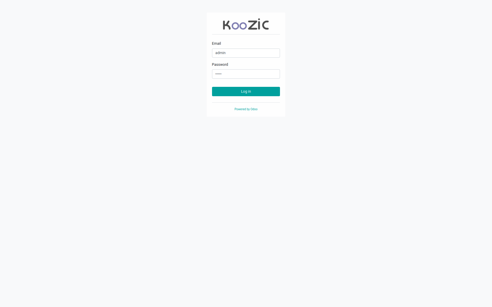
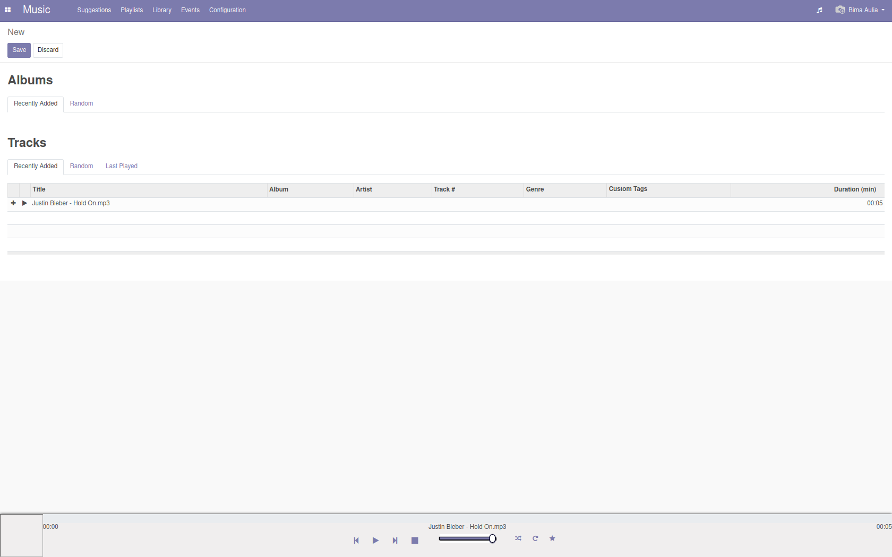
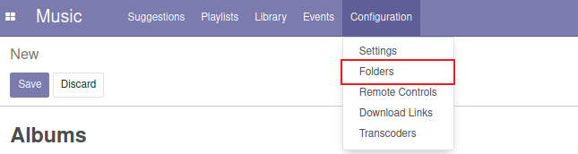
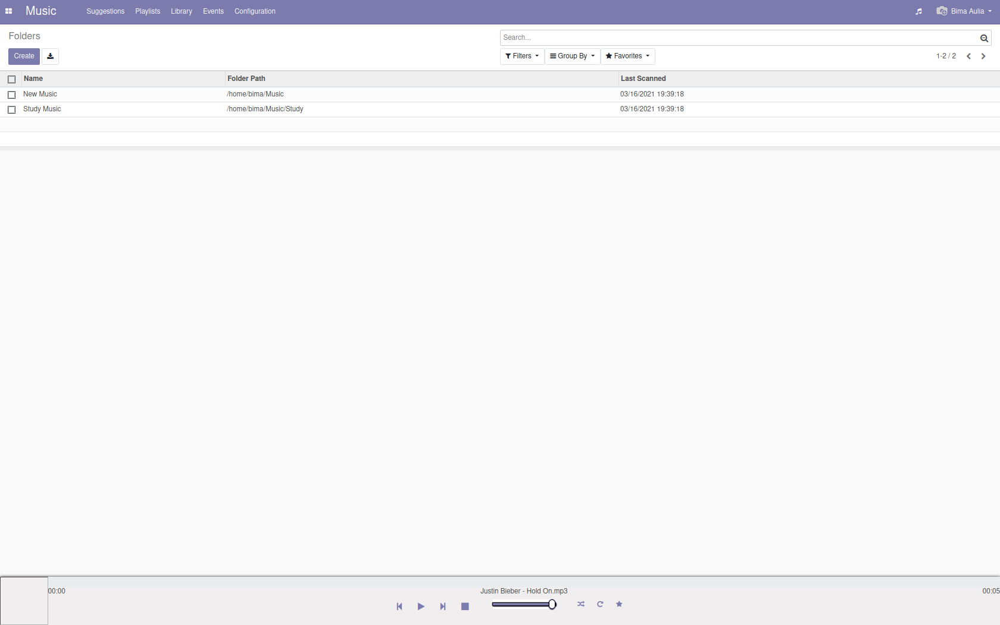
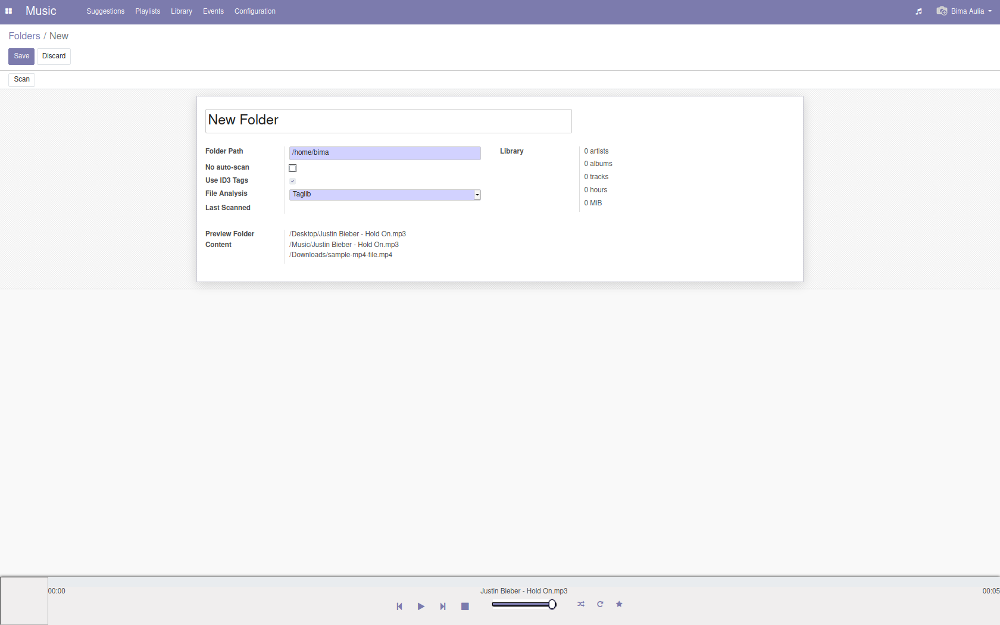
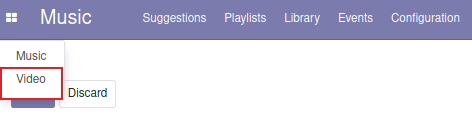

<h1 align="center"></h1>


[Instalasi](#instalasi) | [Konfigurasi](#konfigurasi) | [Otomatisasi](#otomatisasi) | [Cara Penggunaan](#cara-penggunaan) | [Pembahasan](#pembahasan) | [Referensi](#referensi)
:---:|:---:|:---:|:---:|:---:|:---:


# KooZic

Koozic adalah layanan streaming musik berbasis server yang ada pada aplikasi Odoo. KooZic memungkinkan penggunanya untuk mengakses koleksi musik mereka dimanapun dan dari perangkat apapun.

## Instalasi

1. Membuat Spesifik User
   Untuk alasan keamanan, disarankan membuat user dan tidak memakai user root. Contohnya seperti `koozic`.
2. Install Prasyarat
   Sebelum instalasi, pastikan semua package dan pip dependencies sudah terpasang. Berikut packages yang dimaksud:

   - Untuk DEB-based OS: [apt packages](https://github.com/DocMarty84/koozic_install/blob/fdc1649538d75675cfebe4cf4f6ab6fb88eea62c/koozic_install.py#L268-L309), [pip packages](https://github.com/DocMarty84/koozic_install/blob/fdc1649538d75675cfebe4cf4f6ab6fb88eea62c/koozic_install.py#L312-L315)
   - Untuk RPM-based OS: [dnf packages](https://github.com/DocMarty84/koozic_install/blob/fdc1649538d75675cfebe4cf4f6ab6fb88eea62c/koozic_install.py#L327-L381), [extra pip packages](https://github.com/DocMarty84/koozic_install/blob/fdc1649538d75675cfebe4cf4f6ab6fb88eea62c/koozic_install.py#L384-L387)

   pip digunakan untuk menginstall dependencies (bukan menggunakan package manager)

3. Set-up PostgreSQL
   Selanjutnya set-up PostgreSQL. Asumsikan kita akan menjalankan KooZic dengan nama user koozic, maka kita perlu membuat user PosrgreSQL seperti ini
   ```sh
   su - postgres -c "createuser -s koozic"
   ```
4. Download KooZic
   Setelah setup PostgreSQL, download versi terbaru dari KooZic menggunakan file `koozic-*.tar.gz` lalu uncompress arsip yang telah didownload
5. Launch KooZic
   Terakhir, eksekusi skrip dibawah ini sebagai user `koozic` :

   ```sh
   ./odoo-bin --workers=4 -d koozic-v3 --limit-time-cpu=1800 --limit-time-real=3600 --without-demo=all --no-database-list
   ```

   Jika menggunakan Fedora, tambahkan skrip `--db-template=template0` ke command line. Hal ini juga mungkin berlaku di tipe distribusi yang lain.

   Setelah 10-20 detik launching dan pemasangan database, kita dapat menggunakan KooZic di alamat http://localhost:8069 dengan email/password `admin` .

## Konfigurasi

## Otomatisasi

1. Instalasi
   Di terminal, jalankan skrip berikut:
   ```sh
   wget https://raw.githubusercontent.com/DocMarty84/koozic_install/v3/koozic_install.py -O koozic_install.
   ```
   ```sh
   sudo python3 koozic_install.py install
   ```
   Kemudian akses KooZic pada browser Anda di http://localhost:8069 dengan default login dan password nya adalah `admin`. Jangan lupa untuk mengganti password setelah instalasi.
2. Uninstalasi
   Untuk uninstalling, jalankan skrip berikut:
   ```sh
   sudo python3 koozic_install.py uninstall
   ```
   Uninstalasi tidak termasuk penghapusan data pada PostgreSQL, untuk itu remove FFMpeg yang ada pada direktori `/usr/local/bin/ffmpeg`

## Cara Penggunaan

Karna fungsionalitas sistemnya yang bisa dibilang cukup minimum, website koozic ini dinilai cukup mudah untuk digunakan. Cara penggunaan website ini adalah sebagai berikut:

1. Pengguna diharuskan login untuk dapat menggunakan layanan. Untuk pengguna baru dapat menggunakan email dan password **admin**.



2. Setelah login berhasil, user akan masuk ke halaman dashboard musik. Disini user dapat melihat album ataupun musik yang telah dimasukan ke dalam sistem. User dapat memainkan musik yang diinginkan atau memasukkannya ke dalam playlist yang dapat diakes melalui menu navigasi.



3. Untuk dapat memasukan music atau video ke dalam sistem, pengguna terlebih dahulu harus melakukan konfigurasi folder dengan mengakses *configuration folder * pada menu navigasi.



4. Di halaman configuration pengguna dapat menambahkan **path** baru dimana sistem akan secara otomatis dapat melakukan scanning **path** tersebut untuk mendeteksi file musik / video.



5. Tampilan saat melakukan konfigurasi path adalah sebagai berikut.



6. Selain memutar musik. User juga dapat memutar video pada sistem ini. Untuk mengaksesnya user dapat membuka melalui menu navigasi di kiri atas.



7. Tampilan saat memutar video adalah sebagai berikut.


8. Admin dapat menambahkan user baru dan memberikan akses tertentu kepada user tersebut melalui halaman *settings*.


## Pembahasan

## Referensi
